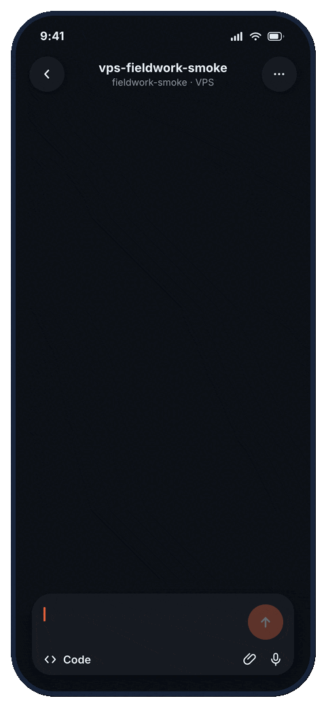

# Fieldwork

[](LICENSE)
[](CHANGELOG.md)
[](docs/known-limitations.md)

**Ship code from your phone without giving a coding agent your forge write token.**

Fieldwork runs Claude or Codex on your VPS, verifies the change, and opens a GitHub pull request or GitLab merge request for review. The agent never receives your GitHub or GitLab write token.

<p align="center">
  
</p>

## Install Fieldwork

```sh
git clone https://github.com/bprateeek/fieldwork.git ~/fieldwork
cd ~/fieldwork
bash install.sh
```

### Try it locally

No VPS. No GitHub token. Requires Docker. About 2 minutes. This spins up the broker shape in Docker so you can watch the pull request path end to end.

```sh
fieldwork eval up && fieldwork eval smoke
```

See [docs/evaluation.md](docs/evaluation.md).

### Set up your VPS

Requires a Mac or Linux workstation, an Ubuntu 24.04 VPS, a GitHub repo or GitLab project, and Claude Code or Codex Desktop access.

```sh
fieldwork setup
```

`fieldwork setup` is the guided path: it checks your local tools, VPS access, remote install, agent login, and broker readiness, then tells you the next action.

No VPS yet?

```sh
fieldwork provision hetzner
fieldwork setup
```

See [docs/first-time-infrastructure.md](docs/first-time-infrastructure.md) for provider setup and the manual VPS path.

## How Fieldwork works

<p align="center">
  
</p>

- Your phone starts a task.
- The agent works on your VPS.
- The verify runner runs lint, typecheck, tests, gitleaks, and semgrep before delivery.
- The broker owns the forge write token and opens the pull request or merge request.
- You review and merge in GitHub or GitLab.

Claude and Codex use different runtime paths, but both preserve the same token boundary. See [docs/architecture.md](docs/architecture.md) and [docs/threat-model.md](docs/threat-model.md) for details.

## Security model

The core rule: the coding agent never receives the forge write token.

- Repos clone with **read-only deploy keys**.
- The agent submits structured, **tokenless** PR requests.
- The **broker** owns the GitHub or GitLab write token and validates repo state, branch names, origins, replay IDs, changed paths, and PR body content before it pushes.
- An optional **Telegram approval gate** adds a human tap before the broker pushes.
- Fieldwork has no Fieldwork-operated telemetry; releases ship signed Git tags and SHA256 checksums ([docs/supply-chain.md](docs/supply-chain.md)).

Read [SECURITY.md](SECURITY.md) and [docs/threat-model.md](docs/threat-model.md) before trusting Fieldwork with a serious repository.

## Developer preview

> [!IMPORTANT]
> Fieldwork is a developer preview.
>
> Supported today: Ubuntu 24.04 VPSes, GitHub, core GitLab, Claude Code, and Codex Desktop over SSH.
>
> Not yet: hosted Fieldwork, Windows-only setup, Gitea, team RBAC, or automatic updates.

See [docs/known-limitations.md](docs/known-limitations.md) and [docs/developer-preview.md](docs/developer-preview.md) for the full list.

## Read next

- [Quickstart](docs/quickstart.md): short guided VPS path.
- [Full setup](docs/setup.md): complete setup guide.
- [Architecture](docs/architecture.md): full system map.
- [Threat model](docs/threat-model.md): trust boundaries and defenses.

Running the broker for a different agent? See the [advanced broker-only install](docs/broker-standalone.md).

## Contributing

Fieldwork is security-sensitive infrastructure. Small, focused PRs are easiest to review. Start with [CONTRIBUTING.md](CONTRIBUTING.md).

## License

Apache-2.0. See [LICENSE](LICENSE).
