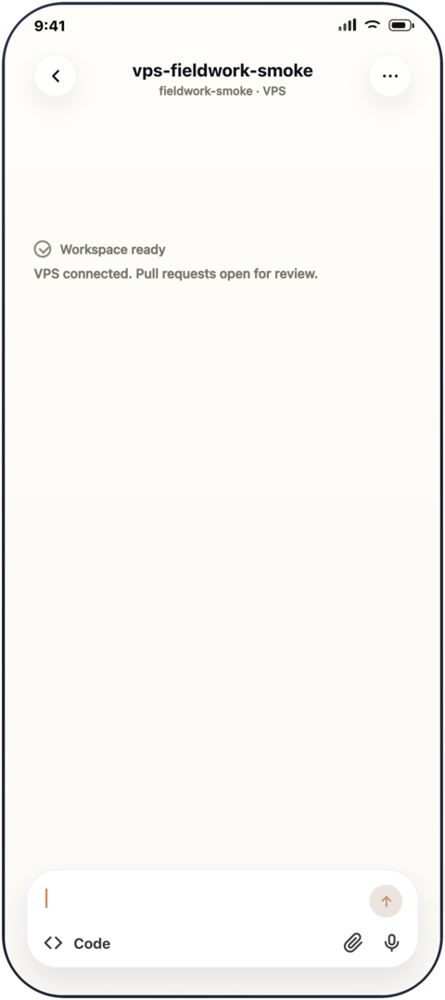
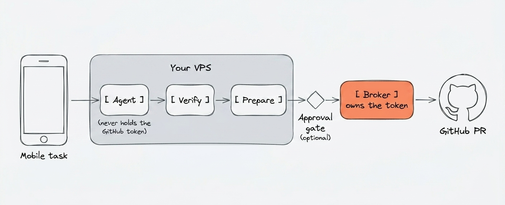

# Fieldwork

**Ship code from your phone without handing a coding agent your GitHub write token.**  
The agent runs on your VPS. A separate broker holds the token and opens pull requests.  
[](LICENSE)
[](docs/developer-preview.md)
[](docs/known-limitations.md)

Developer preview. Try it on a test repo first.

Start a Claude or Codex task from your phone. The agent works on your VPS, verifies the change, and opens a GitHub pull request for review. The agent never receives your GitHub write token.

<p align="center">
  
</p>

## Get started

Ready to set up for real: **Run it** (Mac or Linux workstation + an Ubuntu 24.04 VPS)

Prerequisites:

- A GitHub repo you want the agent to work in
- Claude Code or Codex Desktop access
- Optionally, a Telegram bot for the approval gate

```sh
git clone https://github.com/bprateeek/fieldwork.git ~/fieldwork
cd ~/fieldwork
bash install.sh && fieldwork setup
```

`fieldwork setup` is the guided path: it checks your local tools, VPS access, remote
install, agent login, and broker readiness, then tells you the next action.

No VPS yet?

```bash
fieldwork provision hetzner
fieldwork setup
```

See [docs/first-time-infrastructure.md](docs/first-time-infrastructure.md) for provider setup and the manual VPS path.

Just want to see it work: **Try it** (no VPS, no GitHub token, ~2 minutes)

```sh
fieldwork eval up && fieldwork eval smoke
```

This spins up the broker shape in Docker so you can see the PR path end to end before
committing any infrastructure. See [docs/evaluation.md](docs/evaluation.md).

## How it works

<p align="center">
  
</p>

- Before delivery, the **verify runner** runs lint, typecheck, tests, gitleaks, and semgrep.
- The **broker** owns the GitHub write token (a fine-grained PAT) and validates every request, including schema, branch name, origin, replay, and PR body, before it pushes.

Runtime boundaries differ per agent: Claude runs via `remote-control --sandbox`, and
Codex runs as Codex Desktop + SSH behind a socket/permission allowlist. The invariant
both share is the token boundary above. See
[docs/architecture.md](docs/architecture.md) and
[docs/threat-model.md](docs/threat-model.md) for the full picture.

## Security model

Fieldwork's core rule is that the coding agent does not receive the GitHub write token.

- Repos clone with **read-only deploy keys**.
- The **broker** owns the GitHub write token and opens PRs; the agent submits tokenless, structured requests.
- The broker validates repo state, branch names, paths, origin, replay IDs, and PR body content.
- An optional **Telegram approval gate** requires a human tap before the broker pushes.
- Humans review and merge every PR.

<!--
  Optional: Telegram approve/deny GIF. Replace src with the GitHub-hosted asset URL.
  If omitted, the bullet above already describes the human-in-the-loop gate.
-->
<!--  -->

Read [SECURITY.md](SECURITY.md) and [docs/threat-model.md](docs/threat-model.md)
before trusting Fieldwork with a serious repository.
Fieldwork has no Fieldwork-operated telemetry; releases use signed Git tags
and published SHA256 checksums ([docs/supply-chain.md](docs/supply-chain.md)).

## Developer preview

Fieldwork supports Ubuntu 24.04 VPSes, GitHub repos, Claude Code, and the Codex
Desktop + SSH preview path. It is not a hosted service, does not support Windows-only
setup, and does not yet support GitLab/Gitea, team RBAC, or automatic updates.

See [docs/known-limitations.md](docs/known-limitations.md) and
[docs/developer-preview.md](docs/developer-preview.md) before using Fieldwork on
important repositories.

## Read next

**Start here:**

- [docs/quickstart.md](docs/quickstart.md): short guided VPS path.
- [docs/setup.md](docs/setup.md): full setup guide.
- [docs/evaluation.md](docs/evaluation.md): no-VPS Docker evaluation.

**Understand the system:**

- [docs/architecture.md](docs/architecture.md): full system map.
- [docs/cli-reference.md](docs/cli-reference.md): command reference.
- [docs/threat-model.md](docs/threat-model.md): trust boundaries and defenses.

**Release and operations:**

- [docs/supply-chain.md](docs/supply-chain.md): signed tags, checksums, release checklist.
- [docs/developer-preview.md](docs/developer-preview.md): developer-preview limits.
- [docs/broker-standalone.md](docs/broker-standalone.md): advanced broker-only install for other agents.

## Contributing

Fieldwork is security-sensitive infrastructure. Small, focused PRs are easiest to
review. Start with [CONTRIBUTING.md](CONTRIBUTING.md).

## License

Apache-2.0. See [LICENSE](LICENSE).
